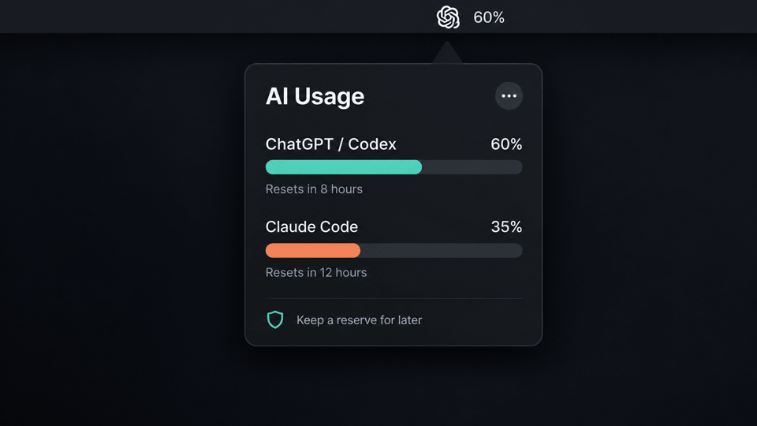

# AI Usage Widgets for macOS

Native macOS menu-bar usage trackers for ChatGPT, Codex, and Claude Code.
See your current usage percentage, reset time, remaining allowance, and pacing
recommendation directly from your Mac menu bar.

Website: https://arjun-rishi-2004.github.io/ai-usage-widgets/

AI Usage Widgets includes two independent native apps: **ChatGPT Usage** for
ChatGPT/Codex rate limits and **Claude Usage** for Claude Code subscription
limits. Install either tracker on its own, or run both to receive local
recommendations about which service has more available usage.

## Install

ChatGPT only: `Scripts/install.sh chatgpt`

Claude only: `Scripts/install.sh claude`

Both trackers: `Scripts/install.sh both`

Claude Usage is **Experimental** because it depends on an undocumented Claude
usage endpoint. The trackers keep local percentage/reset snapshots only. No prompts or conversations are read or stored.

Each app shows the current-session percentage, refreshes regularly, and saves
non-sensitive snapshots so pacing guidance can recommend the other service only
when both trackers have fresh data. It retains a 15% session reserve and 10%
weekly reserve.

## Features

- ChatGPT and Codex usage percentage tracker for macOS
- Claude Code usage percentage tracker for macOS
- Menu-bar percentage indicator and manual refresh
- Current-session and weekly reset information
- Local pacing guidance that protects session and weekly reserves
- Build and install ChatGPT only, Claude only, or both trackers
- No prompts, conversations, analytics, or cloud telemetry

## Uninstall

`Scripts/uninstall.sh chatgpt`, `Scripts/uninstall.sh claude`, or
`Scripts/uninstall.sh both`. Add `--purge-data` to remove local snapshots.
